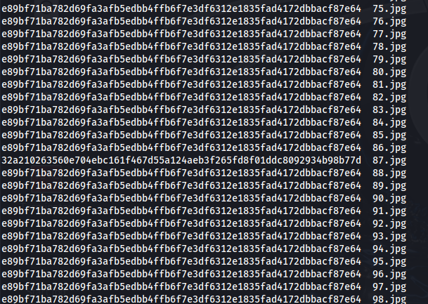

# ACECTF Writeup

## Custom Encoding Scheme

```py
def decode_e1(output_file):
    t1 = "ABCDEFGHIJKLMNOPQRSTUVWXYZabcdefghijklmnopqrstuvwxyz0123456789+/"
    
    with open(output_file, 'r') as f:
        lines = [line.strip() for line in f if line.strip()]
    
    c_bits = []
    t_chars = []
    
    for x, line in enumerate(lines):
        if len(line) != 2:
            raise ValueError("no")
        char1, char2 = line[0], line[1]
        e = t1.index(char1)
        g = t1.index(char2)
        
        a_bits = bin(e)[2:].zfill(6)
        if x < 42:
            d_bits = bin(g)[2:].zfill(6)
            t_bits = a_bits + d_bits[:2]
            c_bits.append(d_bits[2:])
        else:
            d_bits = bin(g)[2:].zfill(2)
            t_bits = a_bits + d_bits
        
        t_char = chr(int(t_bits, 2))
        t_chars.append(t_char)
    
    t = ''.join(t_chars)
    b = ''.join(c_bits) if c_bits else ''
    
    return t, b
t_decoded, b_decoded = decode_e1('output.txt')
print(b_decoded)
```
## Hidden in the traffic

Export all icmp packets to a json file in Wireshark, then:
```py
import json
hiddata=[]
with open("./res.json") as f:
    data=f.read()
data=json.loads(data)
flag=''
for i in data:
    try:
        flag+=chr(int(i["_source"]['layers']['icmp']['data']['data.data'],16))
    except:
        pass
print(flag.replace("ABCDEFGHIJKL",''))
```
## Webrypto

Pass parameters as a list:`https://chal.acectf.tech/Webrypto/?tom[]=a&jerry[]=b`

## Bucket List

Visit https://opening-account-acectf.s3.ap-south-1.amazonaws.com/ , find that there is a `cry-for-me/acectf/secret.txt`. Visit `https://opening-account-acectf.s3.ap-south-1.amazonaws.com/cry-for-me/acectf/secret.txt`, decode the content as base64 to get the flag.

## The Chemistry Of Code

```py
#flag = "ACECTF{4ppr3n71c3_w4l73r_wh1t3}"
import base64
from binascii import unhexlify
from Crypto.Util.number import bytes_to_long, long_to_bytes

FERROUS_OXIDE_USERNAME = "AdminFeroxide"
ANIONIC_PASSWORD = "NjQzMzcyNzUzNTM3MzE2Njc5MzE2ZTM2"
ALKALINE_SECRET = "4143454354467B34707072336E373163335F3634322C28010D3461302C392E"
decoded_password_hex = base64.b64decode(ANIONIC_PASSWORD).decode()
decoded_password = unhexlify(decoded_password_hex).decode()
cation_hex = FERROUS_OXIDE_USERNAME.encode().hex()
anion_hex = decoded_password.encode().hex()
cation_value = bytes_to_long(unhexlify(cation_hex))
anion_value = bytes_to_long(unhexlify(anion_hex))
alkaline_secret_value = bytes_to_long(unhexlify(ALKALINE_SECRET))
covalent_link = cation_value ^ anion_value
metallic_alloy = covalent_link ^ alkaline_secret_value
flag_hex = hex(metallic_alloy)[2:]  
if len(flag_hex) % 2 != 0:  
    flag_hex = "0" + flag_hex

flag = unhexlify(flag_hex).decode()
print(flag)
```
## DONOTOPEN

1. change temp direcory to my own directory
2. remove command "rm -rf temp-directory"
3. open created folder
4. run the pyhotn code and enter ACE@SE7EN as pin 

flag = "ACE{e2e3619b630b3be9de762910fd58dba7}"

## Tabs&Spaces - Steganography

### Description

A mysterious ZIP file containing a collection of images and a file has been discovered.The task is to retrieve the flag.


### Solution

We were provided with a python code and a folder that contains arount 100 hidden jpg images. Analyzing the python code, it seems like it is calculating sha256sum of each image and comparing it with some hash. If there is a match, it returns the matched image name. But we were not given any hash to compare with.

To start off, I calculated the hashes of all images to see if there is anything intersting. For that I found simple bash script to unhide all images.

```bash
#!/bin/bash

mkdir -p new_folder  # Create the destination folder if it doesn't exist

# Loop through all hidden jpg files
for file in .*.jpg; do
    # Skip "." and ".."
    [[ "$file" == "." || "$file" == ".." ]] && continue

    # Remove the leading dot and space from the filename
    new_name="${file#. }"

    # Move the file to new_folder
    mv "$file" "new_folder/$new_name"
done
         
```

After that, calculate `sha256sum` of all images:

`sha256sum *`




Looking closely, we can see that all files have same checksum except `87.jpg`. So this is probably our file. Extract the data from this file using steghide:


We got a txt file that contains some whitespace language. The file seems to be blank but contains some hidden data. Exploring a little bit, I found this python code to convert whitespaces to a normal language:

```python

import sys

def whitespace_to_string(ws):
    ws = ws.replace(' ', '0').replace('\t', '1').replace('\n', '')
    return ''.join(chr(int(ws[i:i+8], 2)) for i in range(0, len(ws), 8))

with open("whitespace_flag.txt", "r") as f:
    data = f.read()

print(whitespace_to_string(data))
```

By running this code, we got our flag.

`ACECTF{n0_3xp1017_n0_g41n}`

## Broken Secrets

Unzip the file, there is a png file, change the file header to get the flag.

## Significance of Reversing

```py
s=open('filename','rb')[::-1]
```
Run the output file to get the flag.

## Hexed and Squared

Execute:
```py
s=s.decode('hex')
```
for many times until getting the flag.

## Fall of 2022

`dig -t txt acectf.tech` to check the TXT record of the domain name.

## Another Reading between the Lines?

```py
with open("hidden", "rb") as f:
    content = f.read()

binary = ""
i = 0
while i < len(content):
    if i+1 < len(content) and content[i:i+2] == b'\r\n':
        binary += "1"
        i += 2
    elif content[i:i+1] == b'\n':
        binary += "0"
        i += 1
    else:
        i += 1

result = ""
for i in range(0, len(binary), 8):
    byte = binary[i:i+8]
    if len(byte) == 8:
        result += chr(int(byte, 2))

print(result)
```
## Keyboard Echo

Used this handy tool - https://github.com/TeamRocketIst/ctf-usb-keyboard-parser

Then did - `tshark -r ./challenge.pcapng -Y 'usb.capdata && usb.data_len == 8' -T fields -e usb.capdata | sed 's/../:&/g2' > keystrokes.txt`

And then - `python3 usbkeyboard.py keystrokes.txt` which gave the flag as ACECTF{y0u_h4v3_f0und_17}

## The mysterious building

From the image i could notice the back tower structure could give me a clue, google lens gave me Pitampura TV Tower, so went to google earth from there, just a couple of places around the structure would have a picture with it that high.

Got here

https://earth.google.com/web/search/Pitampura+TV+Tower,+Muni+Maya+Ram+Jain+Marg,+Netaji+Subhash+Place,+Shakurpur,+Nova+Delhi,+Deli,+Índia/@28.69386127,77.14806815,242.08242798a,0d,60y,43.10399057h,105.04301516t,0r/data=CtcBGqgBEqEBCiUweDM5MGQwMjJkNjFlNWJmOTc6MHg4NDkyNTc2NWY0OWEzNGUxGYdTQaCOsjxAIZVh3A2iSVNAKmZQaXRhbXB1cmEgVFYgVG93ZXIsIE11bmkgTWF5YSBSYW0gSmFpbiBNYXJnLCBOZXRhamkgU3ViaGFzaCBQbGFjZSwgU2hha3VycHVyLCBOb3ZhIERlbGhpLCBEZWxpLCDDjW5kaWEYASABIiYKJAmQBJzoELM8QBEvuJ3-7bE8QBlTsD0swUlTQCF8FiwvJUlTQEICCAEiGgoWN3N1Rk8zVmxSTHJXZnB5TS0tRVYzdxACOgMKATBCAggASg0I____________ARAA

Looked up the building: PP Trade Centre.

ACECTF{pp_trade_centre}

## Virtual Hard Disk

Opened in FTK Imager. Saw in `/root/666c61672e747874.jpg` has Flag and Key(It is shown like a new partition in ftk imager, so it stands out more than the other baits).

CTCHHW{7t3_h1hw3p3sq3_s37i33r_a0l_4li_a3} with key cryforme. Immediately thought vigenere, went to decode, then got it.

ACECTF{7h3_d1ff3r3nc3_b37w33n_y0u_4nd_m3}

## Double Vision

For this one, tried getting the difference between the images in bytes, then a team member said about the right column in `2.png`, zoomed in on the corner there and saw that it was morse. Just decoded it into `ACECTFD07#D45H`, then to the format

ACECTF{D07_D45H}

## Fractured Frames

I saw the description: "Could it be that vital information was concealed rather than erased?", and then tried something. Opened the file in cyberchef, then just deleted some data in about the middle of the file and made it to render image.

The flag appeared as the old parts of the image disappeared.

ACECTF{th1s_sh0uld_b3_en0u6h}

## Social Circles

`@AhjussiPlayz` on youtube only has one video, the subtitles on that video were suspicious, there is an korean subtitle that hints to look for wimebix884, a new singer. Looked up some websites, couldnt find anything.

Then this https://whatsmyname.app gave me a smule [link](https://www.smule.com/wimebix884), it has a single song with lyrics that gave another [link](https://drive.google.com/file/d/1093uvDYSVWke8ze2jdgJ1rVehz51Jx00). This one was an audio with a robotic voice spelling the flag.

ACECTF{mu171m3d14_f146}

## Forensics

### Deep Memory Dive

A string search on "ACECTF" using a hex editor gives the first part of the flag:

```powershell
Set-ItemProperty -Path "HKCU:\Software\Microsoft\Windows\CurrentVersion\Run" -Name "HiddenFlag" -Value "( ACECTF{3xplor1n6_ ) the clipboard is not copying the right things"
echo "( th3_ ) i may have used the wrong command" | clip
Set-ItemProperty -Path "HKCU:\Software\Microsoft\Windows\CurrentVersion\Run" -Name "HiddenFlag" -Value "( ACECTF{3xplor1n6_ ) the clipboard is not copying the right things"
echo "( c0nc3al3d_ ) IS THERE A VIRUS DLL FILE ON MY PC??" > $env:TEMP\hiddenflag.txt`

echo "( th3_ ) i may have used the wrong command" | clip
echo "( th3_ ) i may have used the wrong command" | clip
Set-ItemProperty -Path "HKCU:\Software\Microsoft\Windows\CurrentVersion\Run" -Name "HiddenFlag" -Value "( ACECTF{3xplor1n6_ ) the clipboard is not copying the right things"`

echo "( th3_ ) i may have used the wrong command" | clip`

echo "( c0nc3al3d_ ) IS THERE A VIRUS ON MY PC??"
echo " ( c0nc3al3d_ ) IS THERE A VIRUS ON MY PC??"
```

First part is then `ACECTF{3xplor1n6_th3_c0nc3al3d_`.

Last part has been found by listing the running processes with Volatility3:

```shell
➜  deep_memory_dive python ~/Documents/volatility3/vol.py -f memory_dump.raw windows.info
Volatility 3 Framework 2.11.0
Progress:  100.00		PDB scanning finished
Variable	Value

Kernel Base	0xf80220a8d000
DTB	0x1ab000
Symbols	file:///Users/xx/Documents/volatility3/volatility3/symbols/windows/ntkrnlmp.pdb/D788F72ABE964EFCACAAD0276DAAE6CB-1.json.xz
Is64Bit	True
IsPAE	False
layer_name	0 WindowsIntel32e
memory_layer	1 FileLayer
KdVersionBlock	0xf80220dc7ff0
Major/Minor	15.15063
MachineType	34404
KeNumberProcessors	1
SystemTime	2025-02-26 19:32:24+00:00
NtSystemRoot	C:\Windows
NtProductType	NtProductWinNt
NtMajorVersion	10
NtMinorVersion	0
PE MajorOperatingSystemVersion	10
PE MinorOperatingSystemVersion	0
PE Machine	34404
PE TimeDateStamp	Sat Mar 18 04:40:44 2017
➜  deep_memory_dive python ~/Documents/volatility3/vol.py -f memory_dump.raw windows.pslist
Volatility 3 Framework 2.11.0
Progress:  100.00		PDB scanning finished
PID	PPID	ImageFileName	Offset(V)	Threads	Handles	SessionId	Wow64	CreateTime	ExitTime	File output

4	0	System	0x800096254040	159	-	N/A	False	2025-02-26 19:25:46.000000 UTC	N/A	Disabled
500	4	smss.exe	0x800096592040	3	-	N/A	False	2025-02-26 19:25:46.000000 UTC	N/A	Disabled
584	576	csrss.exe	0x8000973ef7c0	10	-	0	False	2025-02-26 19:25:46.000000 UTC	N/A	Disabled
[...]
1748	784	svchost.exe	0x8000988ea7c0	5	-	0	False	2025-02-26 19:31:39.000000 UTC	N/A	Disabled
1896	3184	last_part_is_{	0x80009832f080	2	-	1	True	2025-02-26 19:32:20.000000 UTC	N/A	Disabled
4764	856	dllhost.exe	0x800098a1c7c0	7	-	1	False	2025-02-26 19:32:21.000000 UTC	N/A	Disabled
720	856	dllhost.exe	0x80009882e7c0	7	-	0	False	2025-02-26 19:32:21.000000 UTC	N/A	Disabled
1040	3184	DumpIt.exe	0x8000988ef7c0	2	-	1	True	2025-02-26 19:32:21.000000 UTC	N/A	Disabled
3492	1040	conhost.exe	0x80009859c080	4	-	1	False	2025-02-26 19:32:21.000000 UTC	N/A	Disabled

```

I then searched for "last_part_is_{" in the memory file and found: `C:\Users\John\Desktop\last_part_is_{r1ddl3s}.exe.exe`.

Flag: `ACECTF{3xplor1n6_th3_c0nc3al3d_r1ddl3s}`

## Miscellaneous

### Hash Guesser

According to the number of hashes in the wordlist, rockyou.txt is used.

I computed the hash of every password from rockyou and stored it in a text file:

```python
import hashlib
import base64

wordlist = "rockyou.txt"


def process_passwords(file_path):
    with open(file_path, "r", encoding="latin-1") as file:
        for line_number, password in enumerate(file, start=1):

            password = password.strip()

            # Convert to base32
            b32_encoded = base64.b32encode(password.encode()).decode()

            # Reverse it
            reversed_b32 = b32_encoded[::-1]

            # Generate MD5 hash
            md5_hash = hashlib.md5(reversed_b32.encode()).hexdigest()

            print(md5_hash, password)


if __name__ == "__main__":
    process_passwords(wordlist)
```

The remote service returns the number of characters in the correct position. I entered a few hashes and wrote a script that returns the matching hashes:

```python
matches = (
    ("ff182a383f27b031ef96bd7161ac4f5c", 2),
    ("81fce5a355bc8ba419b506d3778fefa2", 1),
    ("6b08686c73f81a845330bd9ed102ad25", 2),
    ("7aae51919dd5f6be3e8b70c2a4b52026", 3),
    ("cbcf4e03555d87247ed6fa0982df1cc2", 1),
    ("303a5b46ad94fead2f7a811581cb0a05", 3),
    ("d14a1c097416b478375f91724a05033e", 2),
    ("a20c873b1695f228263e5f765e54297d", 4),
    ("350eeb3922cf245fc1782a96aca1b09d", 1)
)


def count_matches(s1: str, s2: str):
    n = 0
    for i in range(32):
        if s1[i] == s2[i]:
            n += 1
    return n


for line in open("wordlist2.txt"):
    digest = line.split(" ")[0]
    assert len(digest) == 32

    ok = True
    for md, n in matches:
        if count_matches(md, digest) != n:
            ok = False
            break
    if ok:
        print(line)
```

Correct hash was 88ef3cb6cbe5d99e6fee9f1e5cb248ba.

```shell
$ nc 34.131.133.224 5000

The target hash has been taken from a famous wordlist (~14 million passwords).
It was `base32 encoded`, then `reversed`, and then hashed using `MD5`.
Try cracking it. Good luck!

Enter MD5 hash: 88ef3cb6cbe5d99e6fee9f1e5cb248ba
Characters matched: 32/32
Characters in correct positions: 32/32
Match found!
Flag: ACECTF{h45h_cr4ck1n6_r3qu1r35_4_l177l3_w17}
```

Flag: `ACECTF{h45h_cr4ck1n6_r3qu1r35_4_l177l3_w17}`

## Web Exploitation

### Flag-Fetcher

I captured the web traffic using Proxyman and looked for every GET request. Webp file is fetched through a lot of redirections:

http://34.131.133.224/a
http://34.131.133.224/c
http://34.131.133.224/e
http://34.131.133.224/c
http://34.131.133.224/t
http://34.131.133.224/f
http://34.131.133.224/%7B
http://34.131.133.224/r

etc.

Contacatenated each URI to get the flag.

Flag: `ACECTF{r3d1r3ct10n}` (I don't remember if it is uppercase or lowercase)

## OSINT

### For The Fans

Social accounts were listed using Sherlock. That returns a X account:

```shell
$ sherlock DrakeSaltyOVO
[*] Checking username DrakeSaltyOVO on:

[+] HackenProof (Hackers): https://hackenproof.com/hackers/DrakeSaltyOVO
[+] NationStates Nation: https://nationstates.net/nation=DrakeSaltyOVO
[+] NationStates Region: https://nationstates.net/region=DrakeSaltyOVO
[+] Twitter: https://x.com/DrakeSaltyOVO
[+] YouTube: https://www.youtube.com/@DrakeSaltyOVO

[*] Search completed with 5 results
```

This tweet https://x.com/DrakeSaltyOVO/status/1862493972587061676 says to look for another platform, and that he used a longer name account. His name on X is "salty-senpai-drake1". A Google search gives a Tumblr account (actually a link on Tumbig.com, then I went to the tumblr account https://www.tumbig.com/blog/salty-senpai-drake1).

This account shows a long base64 string:

```text
N3q8ryccAAQrDS+tIAAAAAAAAABqAAAAAAAAANGqpB7VL3HfX5dq2a0oNrtZRM2Hum9ExZnUSpeMMG2rzSg6lQEEBgABCSAABwsBAAIkBvEHARJTD3GIJuGJqEfIwbSE/71QeN8hIQEAAQAMIBwACAoBra6o3QAABQEZAQAREwBmAGwAYQBnAC4AdAB4AHQAAAAZABQKAQCfS+NlYELbARUGAQAgAAAAAAA=
```

This is a password-protected 7z archive.

This tweet https://x.com/DrakeSaltyOVO/status/1862495440257822822 indicates the password is 7 digits. There are other tweets that give the birth date of the author as an other hint. I didn't use it and bruteforced the password with hashcat, and got it after 27 minutes. It was indeed the birth date ("2000914").

```shell
$ ../Documents/john/run/7z2john.pl out.7z > hash2.txt
ATTENTION: the hashes might contain sensitive encrypted data. Be careful when sharing or posting these hashes

$ hashcat -m 11600 -a 3 -O hash2.txt "?d?d?d?d?d?d?d"
```

flag.txt in the archive contains the flag.

Flag: `ACECTF{y0u_b3773r_41nt_h4t3}`

### The Symphony of Greatness

A Google search on "modernlouis" show the clip of "[Modern Talking - Brother Louie (Official Video)](https://www.youtube.com/watch?v=Lp2qcCrdBLA)" as first result.

A search on "modern talking most streamed song" returns "Cheri Cheri Lady" with 495,792,144 streams.

I wrote a small script to encode the flag in leetspeak to match the example flag in the challenge description.

```python
s = "Modern_Talking_Cheri_Cheri_Lady"
s = s.lower()
s = s.replace("o", "0")
s = s.replace("i", "1")
s = s.replace("e", "3")
s = s.replace("a", "4")
s = s.replace("s", "5")
s = s.replace("g", "6")
s = s.replace("t", "7")
print(s)
```

Flag: `ACECTF{m0d3rn_74lk1n6_br07h3r_l0u13}`

## Steganography

### Whispering Waves

Zip password can be bruteforced with the wordlist. It is "Vierges".

Then the flag is embedded in the audio spectrum. Use Audacity, open "Spectrogram" view. The flag is encoded in binary (1: high, 0: low). Each bit was manually retrieved.

```python
s = """01000001
01000011
01000101
01000011
01010100
01000110
01111011
00110101
00110011
01100011
01110101
01110010
00110001
01101110
00110110
01110111
00110011
01100010
01111101
"""

flag = ""
for c in s.splitlines():
    flag += chr(int(c, 2))
print(flag)
```

Flag: `ACECTF{53cur1n6w3b}`

### HeaderHijack

Fix the header of the mp4 file. I took the header from https://www.file-recovery.com/mp4-signature-format.htm.

The flag is at the end of the video.

Flag: `ACECTF{d3c0d3_h3x_1s_fun}`

## Cryptography

### Pipher - Piano Cipher

Substitution cipher with music notes. Each note encodes a digit, two notes encode the ASCII value of a char.

```python
s = "DC# DD# DF DD# EC '70' G#B CE F#C FC# C#C# '104' C#A FC# F#A# C#A C#A '108' CF AF# C#C FC# CE '102' FC# C#A# FC# GA# CE '112' FC# C#B C#C# C#A# GC '125'"


def decode_letter(c):
    notes = {
        "A": 1,
        "A#": 2,
        "B": 3,
        "C": 4,
        "C#": 5,
        "D": 6,
        "D#": 7,
        "E": 8,
        "F": 9,
        "F#": 10,
        "G": 11,
        "G#": 12,
    }
    if c[1] == "#":
        a, b = c[:2], c[2:]
    else:
        a, b = c[:1], c[1:]
    return chr(notes[a] * 10 + notes[b])


def main():
    flag = ""
    letters = s.split()
    for c in letters:
        if c.startswith("'"):
            flag += chr(int(c[1:-1]))
        else:
            flag += decode_letter(c)
    print(flag)


if __name__ == "__main__":
    main()
```

Flag: `ACECTF{0h_7h3_f33l16_0f_4_p0p_574r}`

### A Little Extra Knowledge Is Too Dangerous

I solved this one manually, by removing additional packets of "1"s in the decoded binary string to get printable ASCII data.

Then trial and error to rebuild the full flag.

Ugly script:

```python
import base64

s = open("chal.txt").read()
s += "=="
data = base64.b64decode(s)
binary_flag = ""
for c in data:
    binary_flag += f"{c:08b}"
print(binary_flag)

p1 = int(binary_flag[:56], 2)
print(p1.to_bytes((p1.bit_length() + 7) // 8))

pos = 60
p1 = int(binary_flag[pos:pos+152], 2)
print(p1.to_bytes((p1.bit_length() + 7) // 8))

pos = 218
p1 = int(binary_flag[pos:pos+152], 2)
print(p1.to_bytes((p1.bit_length() + 7) // 8))

pos = 377
p1 = int(binary_flag[pos:pos+288], 2)
p1 >>= 1
print(p1.to_bytes((p1.bit_length() + 7) // 8))

pos = 671
p1 = int(binary_flag[pos:pos+144], 2)
p1 >>= 1
print(p1.to_bytes((p1.bit_length() + 7) // 8))

pos = 823
p1 = int(binary_flag[pos:], 2)
p1 >>= 1
print(p1.to_bytes((p1.bit_length() + 7) // 8))
```

Flag: `ACECTF{1_6u355_y0u_7runc473d_7h3_3x7r4_kn0wl363_r4d0m_57r1n66666666666555555555_xxxxxxbbbxxxxxxcccx}`

## Reverse

### Piped Up

Reverse each encoding function (basically all of them are xor except one), and try every possible order until you get something readable.

```python
wanted = [108, 44, 224, 239, 141, 96, 220, 117, 13, 255, 214, 89, 244, 93, 222, 155, 227, 215, 82, 153, 90, 124, 163, 201, 78, 27, 69, 229, 192, 41, 154]
tbl1 = [123, 46, 241, 235, 139, 118, 231, 104, 119, 163, 239, 82, 246, 60, 218, 170, 246, 167, 67, 235, 33, 36, 195, 156, 125, 8, 51, 183, 247, 44, 180]


def unroll_buffer(data: bytes) -> bytes:
    out = []
    prev = 0
    for c in data:
        out.append(c ^ prev)
        prev = c
    return bytes(out)


def decode_password() -> bytes:
    buf = bytes([a ^ b for a, b in zip(tbl1, wanted)])
    buf = unroll_buffer(buf)
    buf = bytes([c ^ 0x56 for c in buf])
    return buf


print(decode_password().decode())
```

Flag: `ACECTF{p1p3d_53cr375_unc0v3r3d}`

## Trust Issues

```py
def recover_flag():
    v3 = [6, 17, 29, 114, 96, 31, 24, 124, 62, 15]
    v4 = [0x6D, 0x78, 0x33, 0x35, 0x40, 0x5E, 0x3E, 0x25, 0x5F, 0x30, 0x78, 0x14]
    v5 = [0x37, 0x4A]  
    A = v3 + v4 + v5
    str2 = b"GRX14YcKLzXOlW5iaSlBIrN7"  
    flag_bytes = []
    for i in range(24):
        xor_value = A[i] ^ str2[i]
        flag_bytes.append(xor_value)
    return bytes(flag_bytes).decode('ascii')
def main():
    flag = recover_flag()
    print(flag)

if __name__ == "__main__":
    main()
```
## Cryptic Pixels

Foremost --> Found zip file have password --> Crack using john and rockyou wordlist --> unzip --> found flag in flag.txt

## Buried Deep

https://mh4ck3r0n3.github.io/posts/2025/02/28/buried-deep

## Token of Trust

https://mh4ck3r0n3.github.io/posts/2025/02/28/token-of-trust

## !Underflow/jumPIEng/Running Out of Time/Super Secure Encryption

https://gist.github.com/h4ckyou/3e6ec98fb205b0208a2dd5dfc8aaf935

## Insanity Check

The weird role `r8F53sXv` in the server is actually a pastebin link. Flag is in https://pastebin.com/r8F53sXv .